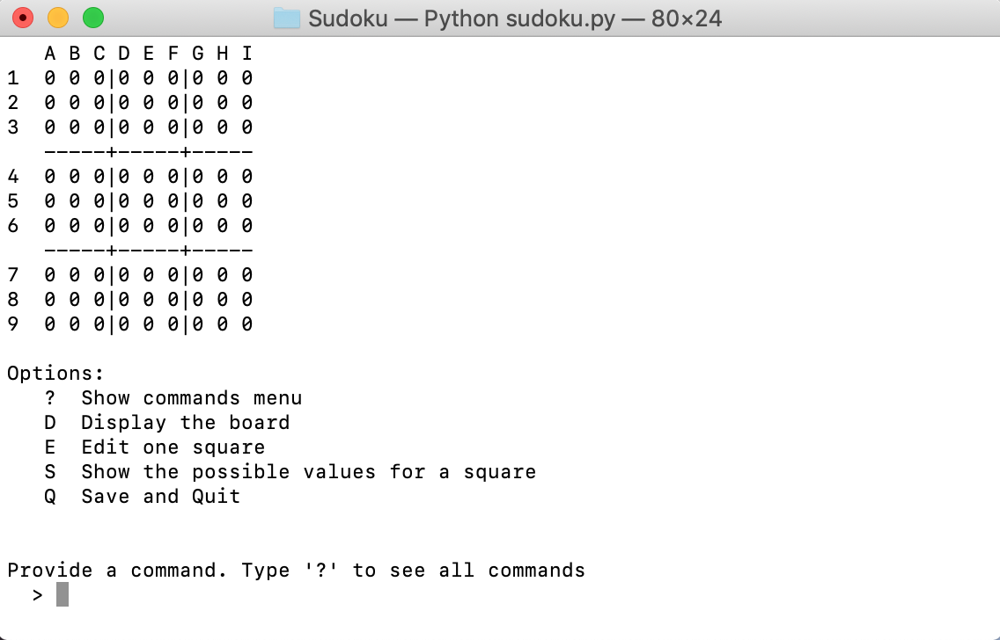
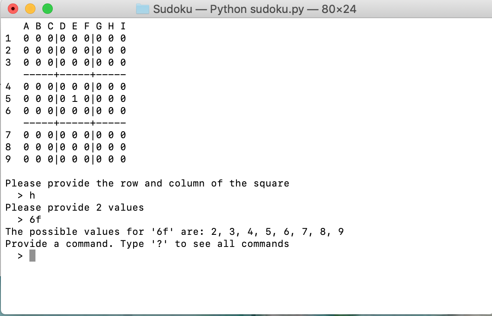

# Sudoku-py

## Description 
This is an implementation of the clasic sudoku game in python
 
This program uses the terminal to display the sudoku board and prompt the user for commands, coordinates and values
 
The user can load and save a game using the propts in the game. 
 
The games are saved as a 'txt' filed and are read by the program to load the status of a sudoku session

## Program Sample 

## Program Set Up
This program used Python3 </b>
Please go to https://www.python.org/downloads/
to install the latest version of Python
 
 
Also, this program requires interface to run python and display the prompts in a terminal. 
 
 
You can install VS Code or Thony to satisfy this requirement. 
 
VS Code download link: https://code.visualstudio.com/
 
Thony download link: https://thonny.org/
 
 
To use the computer terminal, change to the directory where this project is stored and then type python3 sudoku.py in the terminal 

